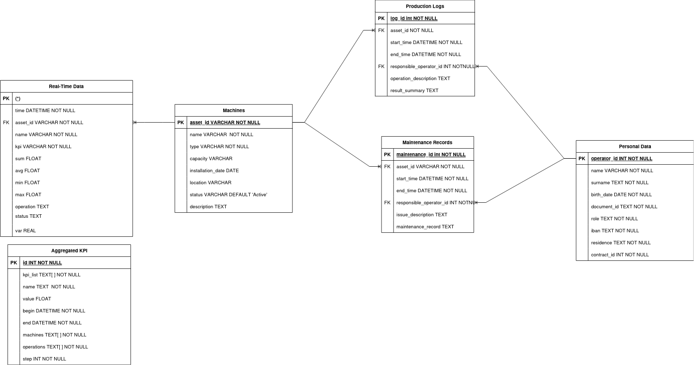

**Table of Contents**

- [Industry 5.0 Data Architecture for Smart Applications](#industry-50-data-architecture-for-smart-applications)
  - [📁 Repository Contents](#-repository-contents)
  - [📜 Introduction](#-introduction)
    - [Industry 5.0 Data Architecture for Smart Applications](#industry-50-data-architecture-for-smart-applications-1)
  - [🚀 Getting Started](#-getting-started)
    - [Prerequisites](#prerequisites)
    - [Setting Up the Database](#setting-up-the-database)
  - [🧪 Testing the Database](#-testing-the-database)
  - [This will run the tests we wrote and show you the results.](#this-will-run-the-tests-we-wrote-and-show-you-the-results)
  - [Try our API](#try-our-api)
  - [Understanding the Architecture and E-R Schema of the Database](#understanding-the-architecture-and-e-r-schema-of-the-database)
  - [🔐 DevSecOps](#-devsecops)

# Industry 5.0 Data Architecture for Smart Applications

This repository contains resources and tools to explore and implement a data architecture framework designed for Industry 5.0. It supports real-time data ingestion and processing for smart applications and can be used for educational purposes in a university course.

## 📁 Repository Contents

The repository contains the following files and directories:

```bash
📂 Project Root
├── 📂 app
│   ├── 📄 backup.py
│   ├── 📄 file_cloud_backup.sh
│   ├── 📄 main.py
│   ├── 📄 run_backup.sh
│   ├── 📄 test_database.py
│   └── 🛠️ .env
├── 📂 backups_decryption
│   ├── 📄 decrypt_backup.py
│   └── 📄 generate_key.py
├── 🛠️ build_db.sh
├── 🐳 docker-compose.yml
├── 🐳 dockerfile
├── 📄 exports.sql
├── 📂 images
│   ├── 🖼️ architecture_diagram.png
│   └── 🖼️ er_schema.png
├── 📜 LICENSE
└── 📖 README.md
```

In order the contents are:

- **`backup.py`**
A Python script for managing database backups and saving the files to the appropriate directory.

- **`file_cloud_backup.sh`**
A shell script for automating the process of uploading backup files to a cloud storage service.

- **`main.py`**
The main entry point for the FastAPI application, serving the API endpoints.

- **`run_backup.sh`**
A shell script to trigger scheduled backups of the database.

- **`.env`**
A configuration file containing environment variables for database credentials, API settings, and other sensitive information.

- **`backups_decryption`**
    **`decrypt_backup.py`**
    A Python script for decrypting encrypted database backup files.
    **`generate_key.py`**
    A Python script for generating and saving a new encryption key used for securing backups.
- **`build_db.sh`**
A shell script that initializes a new database instance, applies the schema, and imports initial data from the provided SQL dump.

- **`docker-compose.yml`**
A Docker Compose configuration file to orchestrate the services required by the project (e.g., database, API, backups).

- **`dockerfile`**
A Dockerfile used to build a custom Docker image for the project, including database tools and the FastAPI application.

- **`exports.sql`**
A PostgreSQL dump file containing the schema and seed data for the project.

- **`images`**
    - **`architecture_diagram.png`**
    A diagram illustrating the architecture of the project.
    - **`er_schema.png`**
    An entity-relationship schema for the database design.

- **`LICENSE`**
The license file specifying the terms of use for this project.

-**`README.md`**
The file you're reading right now.

- **`test_database.py`**
A Python script containing unit tests for validating database functionality.

## 📜 Introduction

### Industry 5.0 Data Architecture for Smart Applications

This project aims to provide a data architecture framework for Industry 5.0 applications. This repo is part of a larger project for the Smart Applications course at the University of Pisa. This architecture is made by using a customised version of `PostgreSQL`. This `PostgreSQL` instance includes two extensions:

- **`TimescaleDB`** which is an open-source time-series extension that allows PostgreSQL to be optimized for fast ingest and complex queries; and
- **`pgvector`** which is a PostgreSQL extension that provides support for vector similarity search and indexing. The architecture supports real-time data ingestion and processing for smart applications and can be used for educational purposes in a university course; and
- **`pgcrypto`** which is a PostgreSQL extension that provides cryptographic functions for encrypting and decrypting data.

## 🚀 Getting Started

### Prerequisites

- [`Docker`](https://www.docker.com/) should be installed on your machine.
- [`Git`](https://git-scm.com/) should be installed on your machine.

### Setting Up the Database

Clone this repository to your local machine using the following command:

```bash
git clone https://github.com/Kreative-Performative-Individuals/smart-industrial-database
```

This will create a new directory named `smart-industrial-database` in your current working directory.
Navigate to the cloned repository and execute the following command from the terminal to build and run the Docker containers:
```bash
docker compose up --build
```
This command will build the Docker image and start the Docker container for the smart-database instance and the pgAdmin instance. 
You can ensure the containers are running by executing the following command:
```bash
docker ps
```
The database instance is already initialized with the schema and seed data from the provided SQL dump file called `exports.sql`. The database is also configured with the necessary extensions for time-series data, vector similarity search and encryption.

The smart-database instance will be available on port `5432`, and the pgAdmin instance will be available on port `5051`. 

`pgAdmin` is a popular open-source administration and development platform for PostgreSQL. You can use pgAdmin to interact with the smart-database instance running in the Docker container. Follow the steps below to set up pgAdmin and connect it to the smart-database instance:

Open your web browser and navigate to `http://localhost:5051`. You will be prompted to log in with the default credentials. Use the following credentials to log in:

- Email: `admin@admin.com`
- Password: `password`

After logging in, you can add a new server connection to the smart-database instance running in the Docker container. Use the following connection details:

- Hostname/address: `kpi-database`
- Port: `5432`
- Username: `postgres`
- Password: `password`

Once you have successfully connected to the smart-database instance, you can explore the database schema, tables, and data. You can also execute SQL queries, create new tables, and perform other administrative tasks using pgAdmin.

If you want to stop the containers, you can run the following command:
```bash
docker compose down
```
This will stop and remove the containers, but the data will persist in the volumes created by Docker.

## 🧪 Testing the Database

If you want to test the database, all you need to do is run the following command:
1. go inside the container by running the following command:
```bash 
docker exec -it kpi-database bash
```
2. place yourself inside the `/app` directory by running the following command:
```bash
cd /app
```
3. run the following command to test the database:
```bash
source /opt/venv/bin/activate \
pytest test_database.py -v
```
This will run the tests we wrote and show you the results.
---

## Try our API

We implemented our endpoints using FastAPI.

After you have started the container and filled the database by using `build_db.sh`, you can try our endpoints by visiting `http://localhost:8002/docs`.

There you can find the instructions and the description of the endpoints and try them using the GUI provided by `FastAPI`.

## Understanding the Architecture and E-R Schema of the Database

The following architecture Diagram shows the overall design of the `Industry 5.0` data architecture, including real-time data flows and processing pipelines.


The following E-R Diagram Illustrates the relationships between entities in the database schema.



---

## 🔐 DevSecOps

DevSecOps is a set of practices that combines software development (Dev) with IT operations (Ops) and security (Sec). It aims to integrate security into the software development process from the beginning, rather than treating it as an afterthought. The following security measures have been implemented in this project:

- **password hashing + salt for the postgres users passwords**: The passwords of the users of postgres by default are hashed and salted to ensure that they are not stored in plain text inside the database.
- **encryption of specific columns for the personal data**: The personal data of the users is encrypted before being stored in the database. This ensures that the data is secure and cannot be accessed by unauthorized users.
- **encryption of the database backups**: The database backups are encrypted before being saved to the `/app/backups` directory of the kpi-database mounted volume. This ensures that the backup files are secure and cannot be accessed by unauthorized users.
